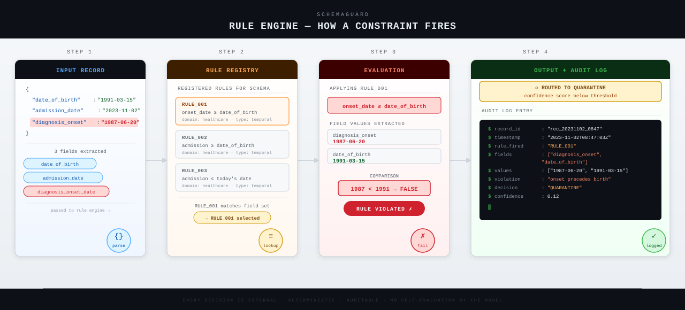

# The Data That Looks Right and Isn't

*How a new class of AI failure is quietly corrupting production pipelines, and what one system is being built to stop it.*

---

The record entered the database on a Tuesday. Nothing flagged it. No alert fired, no exception was thrown, no queue turned red. The patient's file moved downstream into a population health system, where it sat alongside tens of thousands of other records and began shaping the model's understanding of when people get sick, how diseases progress, and what clinical timelines look like. For months, it was indistinguishable from truth. On paper, every field was present, properly formatted, correctly typed. The only problem was that the patient had apparently been diagnosed with a condition four years before they were born.

This is not a story about a bug in the obvious sense. There was no crash. No corrupted file. No missing semicolon. The system performed exactly as designed, which is precisely what made the failure so durable. The error was not loud enough to demand attention. It was quiet enough to become infrastructure.

The expansion of AI-generated structured data into consequential pipelines, including insurance underwriting, clinical intake, and financial transaction summaries, has outpaced the engineering discipline applied to governing it. Organizations deploy language models to extract and format complex information from unstructured text, then pass the outputs into downstream systems built on the assumption that incoming data is coherent. It often is. When it is not, nothing in the standard pipeline is equipped to notice.

---

**The Silent Failure**

Here is the exact shape of the problem. A language model processes a set of clinical notes and returns the following structured output:

```json
{
  "date_of_birth":        "1991-03-15",
  "admission_date":       "2023-11-02",
  "diagnosis_onset_date": "1987-06-20"
}
```

Every field is present. Every date is correctly formatted. The object passes schema validation, the software check that confirms a data structure conforms to its defined shape, without a single error raised. And yet the patient was supposedly diagnosed in 1987, four years before their 1991 birth. The record is structurally flawless and factually impossible. It enters the database. It joins a training corpus. The corruption is statistical, accumulative, and silent.

This is the failure mode that current tooling is not built to catch. Standard schema validation checks the shape of data: are the right fields present, are the types correct, does the date follow the right format? It does not check the *relationship* between fields. It has no mechanism for knowing that a diagnosis cannot precede a birth. That kind of check, a cross-field logical constraint, falls entirely outside its scope.

---

**The Gemini Test**

The intuitive response is to instruct the model more carefully. Write a better prompt. Add a line that says *ensure all dates are logically consistent*. Chain a second AI call to review the first. These are reasonable instincts, and they will catch some errors, but they cannot catch all of them. In systems where compliance is a requirement rather than a preference, "some" is not a number that survives a regulatory audit.

A language model asked to verify its own output is still a language model: a probabilistic system running over the same learned patterns that produced the error in the first place. A subtle inconsistency, one that falls within the model's sense of what plausible data looks like, will pass self-review precisely because the model does not experience it as inconsistent. The verification call is not a logic layer. It is another sampling step from the same distribution. You are not adding determinism. You are adding another roll of a weighted die.

---

**What SchemaGuard Actually Does**

SchemaGuard is a validation pipeline that wraps around a language model's structured outputs and applies a layer of checks the model itself cannot reliably perform. Here is the sequence in plain terms:

```
+-------------------------------------------------------------+
|                   SchemaGuard Pipeline                      |
|                                                             |
|  LLM Output                                                 |
|      |                                                      |
|      v                                                      |
|  [1] Schema Validator     <- Did the fields arrive?         |
|      |                       Are the types right?           |
|      v                                                      |
|  [2] Semantic Validator   <- Do the fields make sense       |
|      |                       together? (deterministic)      |
|      v                                                      |
|  [3] Drift Detector       <- Have outputs shifted from      |
|      |                       historical baseline?           |
|      v                                                      |
|  [4] Confidence Scorer    <- How much should downstream     |
|      |                       systems trust this record?     |
|      v                                                      |
|  Output API  ---------------> Trusted Data                  |
|      |                                                      |
|      +-------- Low confidence ------> Quarantine Queue      |
+-------------------------------------------------------------+

For a general reader: Think of it as a quality-control
checkpoint between "AI produced it" and "we act on it."
```

The first check confirms structural correctness, what existing validation tools already do. The second applies hand-authored logical rules to catch cross-field violations like the date problem above: deterministic binary checks that either pass or fail. The third, the drift detector, works like a control chart in a factory: it keeps a record of what normal output has looked like over time, then raises a flag when the current batch starts looking meaningfully different. If a model is quietly updated, or a prompt is changed, or the temperature setting drifts, the outputs shift in ways no individual record would reveal. The drift detector catches the pattern across records that individual validation cannot see. The fourth aggregates these signals into a confidence score, routing records below threshold into a quarantine queue rather than passing them downstream unchecked. Every decision, whether pass, flag, or quarantine, is logged with a full explanation: which rule fired, which fields were involved, and what the conflict was.

None of these stages ask the language model to evaluate itself. The logic is external, deterministic, and auditable by design.

---

**Inside the Rule Engine: How a Constraint Actually Fires**

The semantic validator is the layer that catches what schema validation cannot. Here is exactly what happens when a record arrives and a rule fires, from field extraction through to the audit log entry on the other side.



- **Step 1:** Fields are extracted from the incoming record.
- **Step 2:** The rule registry matches the field set to the relevant constraint.
- **Step 3:** The rule is evaluated as a deterministic binary check, true or false, with no interpretation.
- **Step 4:** The decision, the fields involved, the values, and the confidence score are written to a structured audit log. If the record fails, it routes to quarantine with a full explanation attached.

---

The system makes no promise that language models can be made perfectly reliable. It makes a narrower claim: that structured outputs consumed by production systems deserve the same rigorous compliance layer applied to any other data pipeline, and that this layer can be built with discipline, evaluated honestly, and deployed before someone's record becomes a data point that should never have existed.

The pipeline does not stop the model from being wrong. It stops the wrongness from going unnoticed.

---

**Reflection**

The opening originally moved too quickly from the database entry to abstraction, bypassing the most important beat: what the corrupted record actually did once it arrived. Adding the population health system's learning behavior made the consequence concrete enough to carry the rest of the piece. An earlier draft of the system-description paragraph buried the drift detector in a list clause; pulling it into its own sentence with the factory control-chart analogy was the single most useful structural change in revision. The diagram stayed where it was, as that placement was already correct.

---

# Wait, Can't ChatGPT Just Double-Check Its Own Work?

*A patient was diagnosed before they were born. The software thought everything was fine. Here is why that is a much harder problem than it sounds, and what someone is building to fix it.*

---

Let's start with a weird question: **If an AI writes you a perfect-looking spreadsheet full of impossible numbers, how would you know?**

Not impossible like "these don't add up." Impossible like: *this person was diagnosed with a condition four years before they were born.* All the formatting is correct. All the fields are present. The dates look like dates. The spreadsheet opens fine. And somewhere downstream, a medical system is now learning from a record that cannot exist.

No alarm went off. No error message appeared. The data just moved through the pipeline and became infrastructure.

This is the problem SchemaGuard is being built to solve. And before we get into how it works, we need to understand why the obvious solutions don't actually work.

---

## "Just tell the AI to check its own output."

Yeah. This was my first thought too.

You write a system prompt. You add a line: *Before returning data, verify that all dates are logically consistent.* Maybe you chain a second AI call, using one model to generate and another to review. Seems reasonable.

Here's the uncomfortable part: it doesn't work reliably enough to count on.

A language model reviewing its own output is still a language model. It is a system that has learned to produce things that *look plausible*, and a date that looks plausible individually will often survive the model's own self-review, because the model doesn't experience it as wrong. The inconsistency has to be subtle enough to slip through in the first place, which means it is exactly the kind of inconsistency the model is least equipped to catch when asked to look again.

You're not adding a logic layer. You're adding another roll of the same dice.

---

## Okay, but you're kind of making this sound worse than it is.

**You're right to push back. Let me be precise.**

Better prompting genuinely helps. Explicit instructions, structured examples, careful reasoning prompts, all of these improve output quality meaningfully. The argument here isn't that prompting is useless. It's that prompting has a ceiling, and that ceiling falls short of what certain production environments actually require.

Here's the math that makes this concrete: if a model follows a compliance rule correctly 97% of the time with good prompting, and a pipeline processes 10,000 records per day, that's 300 violations daily. In a consumer financial system. That's not a probability, that's a rate.

Deterministic logic doesn't drift. It doesn't interpret rules loosely. It doesn't fail more often on Tuesdays. It checks the rule and returns true or false. That's what's missing.

---

## Fine. But now you're going to tell me there's some magic AI layer that catches everything.

There isn't. That's worth saying clearly before we go further.

SchemaGuard catches what you explicitly define as catchable. It applies rules that a human wrote, to fields that a human specified, in domains that a human understood well enough to model. It does not learn new rules on its own. It does not generalize to scenarios nobody anticipated. Every new industry, every new schema, every new deployment context requires someone to sit down and author the constraints from scratch. If the rule-writer's domain knowledge has a blind spot, the system has that blind spot too.

This is a real limitation. It is also the honest version of what "deterministic validation" actually means.

---

> **TL;DR: Things are getting technical. Here is where we are.**
>
> Language models produce structured data (JSON, basically: named fields with values). Standard software checks confirm the data *has the right shape*. What it doesn't check: whether the values *make sense together*. A birth date and a diagnosis date that contradict each other will both pass shape-checking just fine. SchemaGuard is a separate layer that applies explicit logical rules to catch the contradiction. It doesn't ask the model. It checks independently.

---

## So what does "perfect output" actually mean?

This is the "ground truth" problem, and it's the part of any validation system that's easiest to fudge and hardest to get right.

Here's how SchemaGuard approaches it. Before running any tests, the team builds a hand-labeled dataset across three domains: patient intake records, financial transactions, and API configuration objects. Each record is labeled by a human: *Does this pass structure? Does this make logical sense? Is this a silent failure?*

Think of it as a slow, careful person reading every record and asking the question that the software never thought to ask: *does this make sense as a description of something that could actually happen to a real person?*

A **silent failure** is defined precisely: it parses without error, passes schema validation, and violates at least one cross-field logical rule. The diagnosis-before-birth example qualifies. A loan approval that exceeds an applicant's stated annual income by a factor of fifty qualifies. A configuration object that simultaneously enables read-only mode and active write permissions qualifies.

The rules that catch these failures are written *before* the test runs. Not reverse-engineered from the results. This matters because it is very easy to build a system that looks good on paper by tuning the rules until the numbers come out right. That's not validation, that's circular reasoning with extra steps.

```
What "ground truth" means in plain English:

  +------------------------------------------------------+
  |  A record is "valid" only if it passes BOTH:         |
  |                                                      |
  |  + Structure check: right fields, right types        |
  |                                                      |
  |  + Sense check: values coherent with each other      |
  |                  (birth before diagnosis,            |
  |                   income before loan amount,         |
  |                   read/write modes compatible)       |
  |                                                      |
  |  Passing one and failing the other = silent failure  |
  +------------------------------------------------------+
```

---

## The ethics part: and it's not the part you expect.

The obvious data privacy question has a clean answer: SchemaGuard doesn't use personal records. The evaluation dataset is synthetic, AI-generated, human-verified, built from scratch. No real patient files. No real financial records.

The less obvious problem is the rules themselves.

When you write a logical constraint, "a patient's diagnosis cannot predate their birth," you're encoding an assumption about what's possible. Most of those assumptions are correct. Some aren't. A rule built from incomplete domain knowledge will produce false positives that may not fall evenly across different populations. The person writing the rule might not know every edge case. A rare but legitimate clinical scenario might trip the constraint by accident.

This is why every rule in SchemaGuard is documented with an explicit rationale, versioned as a formal artifact, and subject to revision. Rules aren't buried in code, they're auditable decisions. And when the system blocks a record, it explains which rule fired and which fields were involved. An opacity layer wearing a compliance badge would be worse than no layer at all.

The quarantine queue, where low-confidence records go, is paired with a human review process. Blocked outputs don't get silently discarded. They get explained, flagged, and reviewed. The system assumes it will sometimes be wrong, and it's designed for that.

---

## So does this actually solve it?

Mostly, within carefully defined limits.

The semantic rule engine catches cross-field logical violations deterministically. The drift detector monitors whether output patterns have shifted over time. Think of it as watching for the moment when the pipeline's "normal" quietly becomes something different, before any single record gives it away. The confidence scorer routes uncertain records out of the live pipeline. All decisions are logged with full explanations.

What it doesn't do: generalize automatically. Every new deployment domain, every new schema, every new industry, requires someone to sit down and write the rules for that domain. That's labor-intensive. It's also honest. The system catches exactly what you've explicitly defined as catchable, and nothing more.

---

## The question this opens.

Here's what I keep thinking about after going through this: the *rules* are the hard part. The engineering is tractable. Writing a rule engine is a solved problem. But knowing *which rules to write*, knowing what "logically impossible" means in a domain you might not be an expert in, that's where things get genuinely difficult.

What happens when the rule-writer's domain knowledge is the thing that's wrong?

SchemaGuard has an answer for this: versioning, documentation, human review. But it's still a human answer to a human problem. And as these pipelines get faster and deeper, the lag between "we deployed the wrong rule" and "we noticed we deployed the wrong rule" is going to be worth watching very carefully.

---

**Reflection**

The original draft's skeptical pushback moment was too soft. "You're making this sound worse than it is" invited agreement too quickly and moved on. Adding a second, harder pushback ("now you're going to tell me there's some magic AI layer") forced an earlier and more honest reckoning with the system's core limitation, which the original version buried in the final section. The ground truth section previously moved from definition to diagram without pausing on why any of it matters to a human reader; the added sentence about a slow, careful person reading each record gave it the weight it needed before the technical box appeared.
